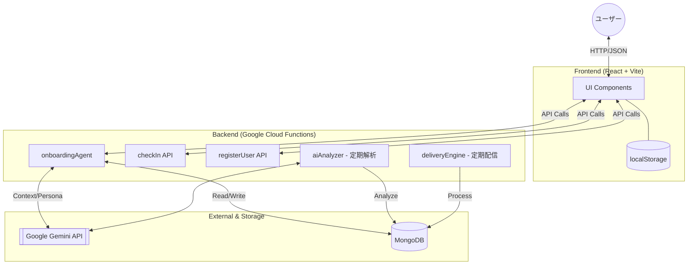
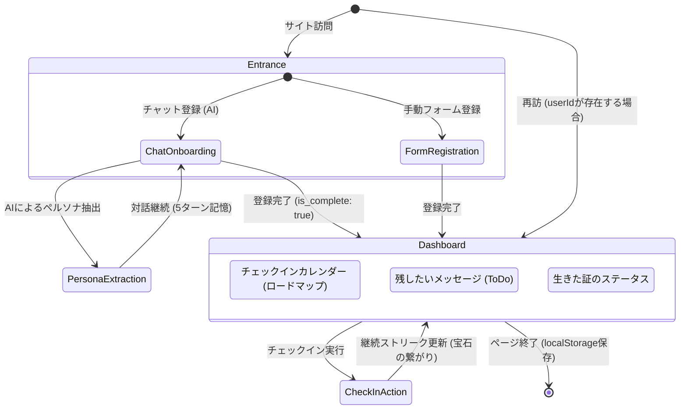

# Amber Ink - システム構成・画面遷移図（中間発表用）

「琥珀（Amber）」に刻む、永遠の「インク（Ink）」。
孤独孤立を防ぎ、個人の「生きた証」を保護するオンボーディング・パーソナルアシスタント。

---

## 1. システム構成図 (System Architecture)

バックエンドは Google Cloud Functions (Node.js) をベースとし、生成 AI (Gemini API) と NoSQL (MongoDB) を連携させたマイクロサービス構成です。

### 主要技術スタック
- **Frontend**: React, Tailwind CSS, Lucide-React
- **Backend**: Node.js, Google Cloud Functions Framework
- **AI**: Google Gemini 2.5-flash (モデル可変)
- **Database**: MongoDB (Session & Persona Storage)
- **Environment**: Podman / Docker Compose (Local Dev)

---

## 2. 画面遷移・動線 (Screen Transition Flow)

ユーザーは「対話」を通じて自然に登録を終え、日々の「宝石（チェックイン）」を積み上げるロードマップへと誘導されます。

### ユーザー体験のポイント
1.  **温かいオンボーディング**: AIエージェントが「監視」ではなく「宝石を守る」というメタファーで対話し、性格や興味（ペルソナ）を理解。
2.  **PII-Free Context**: 会話履歴ではなく「ペルソナ要約」を保持することで、プライバシーを守りつつ親密な対話を実現。
3.  **視覚的な継続意欲**: チェックイン履歴が「道（パス）」のように繋がるカレンダーにより、日々の積み重ねを宝石として実感。
4.  **シームレスな再開**: `localStorage` を活用し、会話の途中からでも、ダッシュボードからでも、訪問時の「挨拶」が時間帯に合わせて変化。
