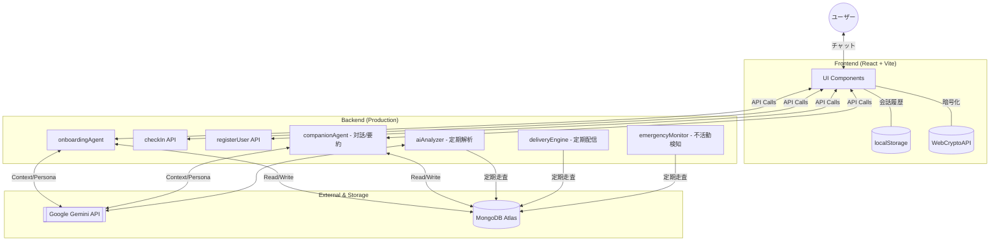
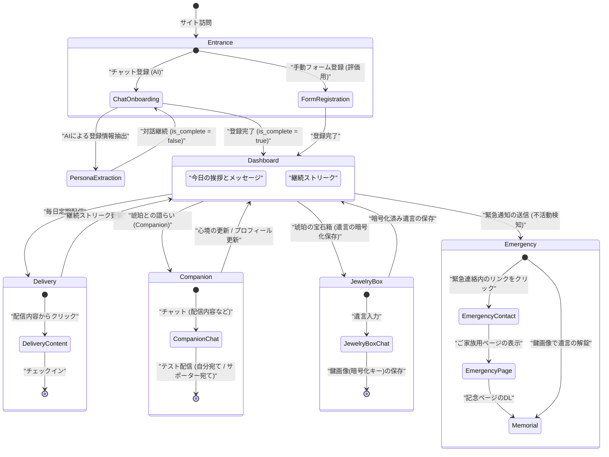

# Amber Ink - システム構成・画面遷移図

「琥珀（Amber）」に刻む、永遠の「インク（Ink）」。
孤独孤立を防ぎ、個人の「生きた証」を保護するオンボーディング・パーソナルアシスタント。

---

## 1. システム構成図 (System Architecture)

バックエンドは Google Cloud Functions / Node.js をベースとし、生成 AI (Gemini API) と NoSQL (MongoDB Atlas) を連携させたマイクロサービス構成です。運用効率と安定性の観点から、現在は**集約型バックエンド (Aggregated Backend)** を標準構成として採用しています。

### 主要技術スタック
- **Frontend**: React, Tailwind CSS, Web Crypto API
- **Backend**: Node.js, Google Cloud Functions
- **AI**: Google Gemini 2.5-flash
- **Database**: MongoDB Atlas
- **Hosting**: GitHub Pages (Front) / Cloud Run (Back)

---

## 2. 画面遷移・動線 (Screen Transition Flow)

ユーザーは AI との温かい対話を通じて自然に登録を終え、日々の「宝石（チェックイン）」を積み上げながら「生きた証」を残していきます。

## 3. 遺言暗号化、鍵画像生成

- **情報の入力**: 暗号化したいコンテンツ（遺言、パスワード等）を入力し、鍵の「素体」となる画像を選択します。
- **ハイブリッド暗号化**: コンテンツは **AES-256** で暗号化し、その AES 鍵をユーザー固有の **RSA-2048** 公開鍵で保護します。
- **鍵画像の生成 (電子透かし)**: RSA 秘密鍵をステガノグラフィ技術で画像データの中に不可視な状態で埋め込みます。一目で鍵とわかるよう「ユーザーのニックネーム」を電子透かしとして合成します。
- **分散管理の徹底**:
    - **ユーザー**: 秘密鍵を含む「鍵画像」をローカルにダウンロードして保管 (サーバー通信一切なし)。
    - **サーバー**: 「暗号化済みコンテンツ」と「公開鍵」のみを保持（サーバー側での解錠は不可能）。
- **継承と解錠**: 万一の際、家族は「記念ページ」にユーザーの「鍵画像」を読み込ませることで、(オフラインの環境でも)ブラウザ上で安全に内容を解錠・閲覧できます。
- **利便性**: 公開鍵をサーバーに置くことで、鍵画像を再生成（再配布）することなく、遺言の内容のみを何度でも更新可能です。

---

## 4. ユーザー体験のポイント
1. **温かいオンボーディング**: AIエージェントが「監視」ではなく「宝石を守る」というメタファーで対話。
2. **PII-Free Context**: 会話履歴ではなく「ペルソナ要約」を保持することで、プライバシーと親密さを両立。
3. **視覚的な継続意欲**: チェックイン履歴が「道」のように繋がるカレンダーにより、日々の積み重ねを実感。
4. **究極のプライバシー**: Web Crypto API を活用し、暗号化処理を 100% クライアントサイドで実行する「トラストレス」設計。